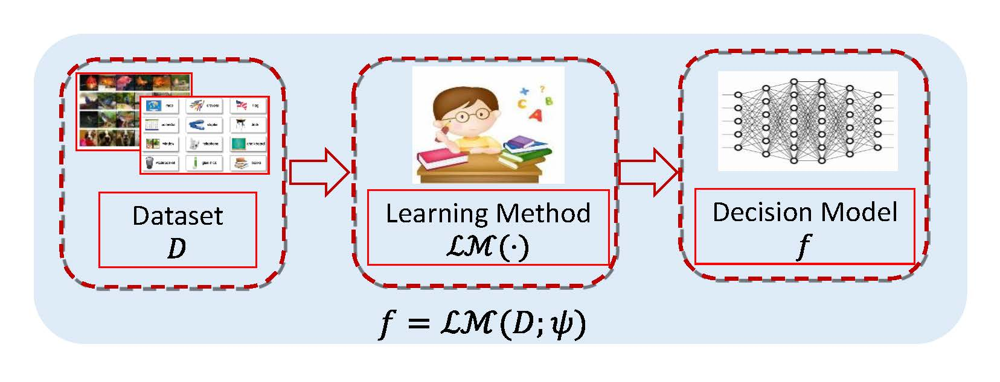
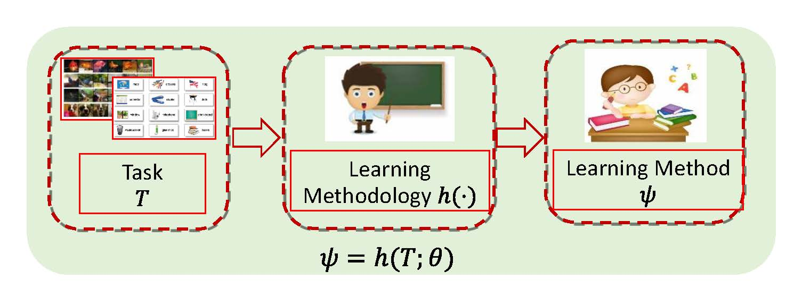

# SLeM-Theory
JMLR2023: Learning an Explicit Hyper-parameter Prediction Function Conditioned on Tasks (Official Pytorch implementation)

The implementation of meta-regularization proposed in our SLeM theory paper "Learning an Explicit Hyper-parameter Prediction Function Conditioned on Tasks". Jun Shu, Deyu Meng, and Zongben Xu. [Arxiv Vervision](https://arxiv.org/pdf/2107.02378.pdf)


****
## CONTENTS

* [Overview](#overview)
* [Proposed Meta-Regularization Strategies](#proposedmeta-regularizationstrategies)
* [Experiments](#experiments)


  ## Overview
Meta learning has attracted much attention recently in machine learning community. Contrary to conventional machine learning aiming to learn inherent prediction rules to predict labels for new query data, meta learning aims to simulate learning methodology (SLeM) for machine learning from observed tasks, so as to generalize to new query tasks by leveraging the meta-learned learning methodology. In this study, we interpret such learning methodology as learning an explicit hyper-parameter prediction function shared by all training tasks. Specifically, this function is represented as a parameterized function called meta-learner, mapping from a training/test task to its suitable hyper-parameter setting, extracted from a pre-specified function set called meta learning machine. Such setting guarantees that the meta-learned learning methodology is able to flexibly fit diverse query tasks, instead of only obtaining fixed hyper-parameters by many current meta learning methods, with less adaptability to query task's variations. Such understanding of meta learning also makes it easily succeed from traditional learning theory for analyzing its generalization bounds with general losses/tasks/models. The theory naturally leads to some feasible controlling strategies for ameliorating the quality of the extracted meta-learner, verified to be able to finely ameliorate its generalization capability in some typical meta learning applications, including few-shot regression, few-shot classification and domain generalization.
<div  align="center">    
    
   
</div>

## Proposed Meta-Regularization Strategies

- Tanh: Control the output range of the meta-learner. All activation functions of CNN are usually assumed to be ReLU, while we revise the last activation function as "Tanh".  
- L$^2$-SP: Minimize the distance between the weights from the starting point weights.


## Experiments
To validate the effectiveness of proposed meta-regularization strategies for the meta-learner, we conduct experiments on some typical meta learning applications, including few-shot regression, few-shot classification and domain generalization.


## Citation
If you find this code useful, please cite our paper.

```
@@inproceedings{SLeM,
  	title={Learning an Explicit Hyper-parameter Prediction Function Conditioned on Tasks},
  	author={Jun Shu, Deyu Meng, and Zongben Xu},
  	journal={Journal of Machine Learning Research},
    pages={1-74},
  	year={2023}
    }
```

## Acknowledgments
We appreciate the following github repos for their valuable codebase:

- https://github.com/jiaxinchen666/meta-theory
- https://github.com/kjunelee/MetaOptNet
- https://github.com/liyiying/Feature_Critic

